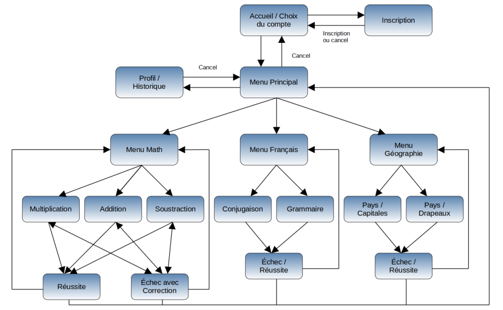
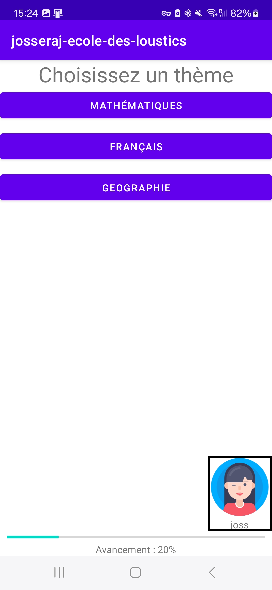
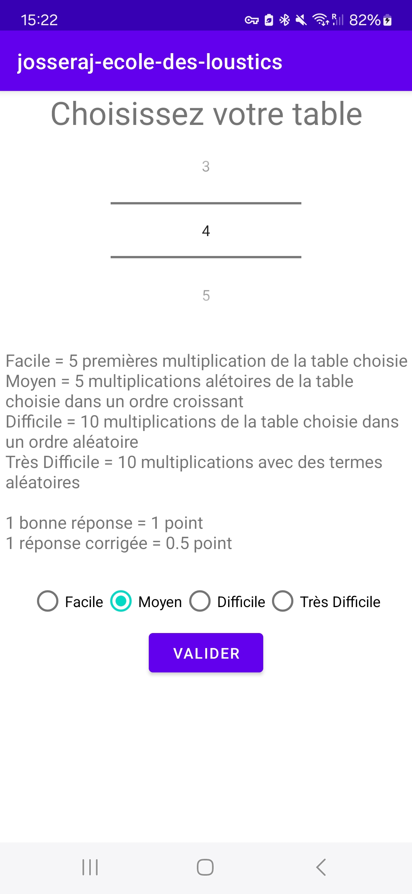
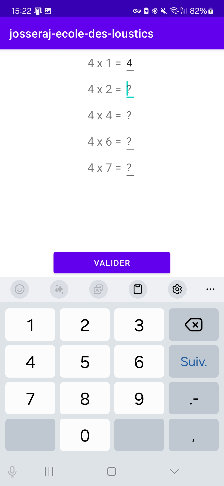
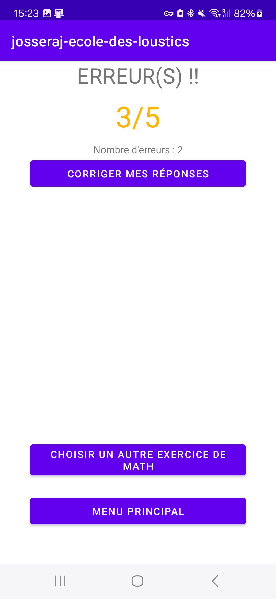
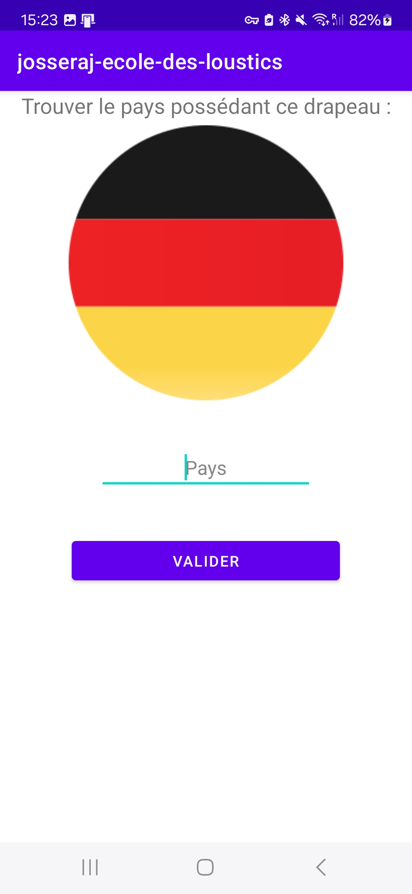
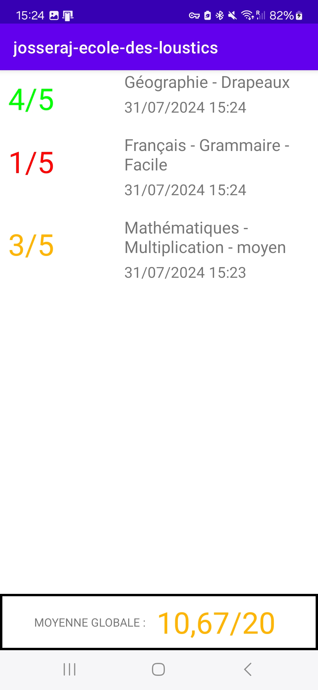

# Ecole des loustics

## Présentation

L'objectif de ce projet était la réalisation d'une application en Android Java pour enfant qui devait proposer des exercices scolaires. Il a été réalisé en 2e année de DUT Informatique en 2021. Cette application avait quelques fonctionnalités obligatoires requises :
- Connexion/Inscription avec un compte
- Possibilité de se connecter avec un compte Anonyme
- Exercice de multiplication avec un choix de la table souhaitée

En plus de ces 3 fonctionnalités de base, nous avions la possibilité d'implementer toutes les extensions que nous souhaitions en fonction de notre motivation. Voici la liste des fonctionnalités rajoutées :
- Ajout d'exercices de mathématiques (Additon et soustraction)
- Ajout de niveau de difficultés pour les exercices de mathématiques (Facile/Moyen/Difficile/Très difficile)
- Création d'une catégorie "français" avec des exercices de conjugaison et grammaire.
- Création d'une catégorie "géographie" avec des exercices sur les pays avec les capitales et les drapeaux.
- Possibilité de voir les erreurs et les corrections sur les exercices.
- Possibilité de corriger ses erreurs lors de la validation pour les exercices de mathématiques.
- Ajout d'une page d'historique des exercices effectués.
- Page de modification de profil.

## Workflow

Ce workflow représente toutes les pages (`activities`) de ce projet.

## Démonstration

Voici le [lien de la démonstration](https://youtu.be/CRj2etItqMo).

## Exemple de pages

### Accueil connecté

### Mathméatiques - Menu Multiplications

### Mathméatiques - Multiplications

### Mathméatiques - Multiplications Erreurs

### Géographie - Drapeaux

### Historique

## Crédits

Avatars de Laura Reen sous la [Creative Commons Licence](https://creativecommons.org/licenses/by/4.0/)
  